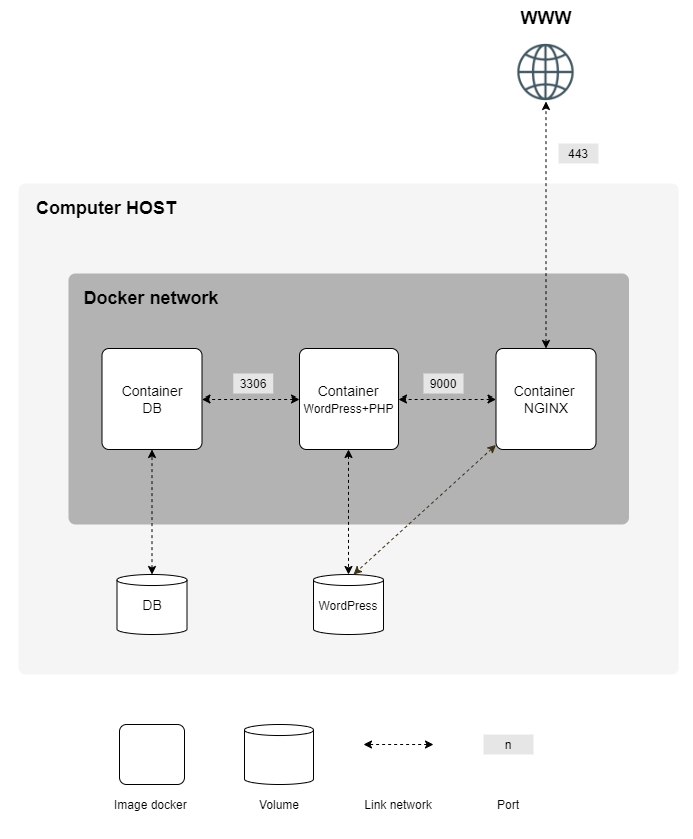

# `Inception`

This project aims to broaden your knowledge of system administration by using Docker.
You will virtualize several Docker images, creating them in your new personal virtual machine.

### Discription of mandatory part
This project consists in having you set up a small infrastructure composed of different services under specific rules.

#### Rules:
- This project need to be done on a Virtual Machine.
- All the files required for the configuration of your project must be placed in a `srcs` folder.
- A `Makefile` is also required and must be located at the root of your directory. It must set up your entire application (i.e., it has to build the Docker images using `docker-compose.yml`).
- Each Docker image must have the same name as its corresponding service.
- Each service has to run in a dedicated container.
- For performance matters, the containers must be built either from the penultimate stable version of `Alpine Linux`, or from `Debian Buster`.
- You also have to write your own `Dockerfiles`, one per service.
- The `Dockerfiles` must be called in your `docker-compose.yml` by your `Makefile`.
- No password must be present in your `Dockerfiles`.
- It means you have to build yourself the Docker images of your project. It is then forbidden to pull ready-made Docker images, as well as using services such as DockerHub (`Alpine`/`Debian` being excluded from this rule).
- Of course, using `network:` `host` or `--link` or `links:` is forbidden.
- Your containers musn’t be started with a command running an infinite loop. Thus, this also applies to any command used as entrypoint, or used in entrypoint scripts. The following are a few prohibited hacky patches: `tail -f`, `bash`, `sleep infinity`, `while true`.
- Your NGINX container must be the only entrypoint into your infrastructure via the port `443` only, using the TLSv1.2 or TLSv1.3 protocol.

#### Tasks:
- A Docker container that contains `NGINX` with TLSv1.2 or TLSv1.3 only.
- A Docker container that contains `WordPress` + php-fpm (it must be installed and configured) only without nginx.
- A Docker container that contains `MariaDB` only without nginx.
- A `volume` that contains your WordPress database.
- A second `volume` that contains your WordPress website files.
- A docker-network that establishes the connection between your containers.
- Your containers have to restart in case of a crash.
- In your WordPress database, there must be two users, one of them being the administrator. The administrator’s username can’t contain admin/Admin or administrator/Administrator (e.g., admin, administrator, Administrator, admin-123, and so forth).
- Your `volumes` will be available in the `/home/login/data` folder of the host machine using Docker. Of course, you have to replace the login with yours.
- To make things simpler, you have to configure your domain name so it points to your local IP address. This domain name must be `login.42.fr`. Again, you have to use your own `login`. For example, if your `login` is `wil`, `wil.42.fr` will redirect to the IP address pointing to wil’s website.
- It is mandatory to use environment variables. Also, it is strongly recommended to use a `.env` file to store environment variables. The .env file should be located at the root of the `srcs` directory.

### Discription of bonus part
__The bonus part will only be assessed if the mandatory part is PERFECT. Perfect means the mandatory part has been integrally done and works without malfunctioning.__

A `Dockerfile` must be written for each extra service. Thus, each one of them will run inside its own container and will have, if necessary, its dedicated volume.

   

#### Tasks:
- Set up `redis` cache for your WordPress website in order to properly manage the cache.
- Set up a `FTP server` container pointing to the volume of your WordPress website.
- Create a simple static website in the language of your choice except PHP (Yes, PHP is excluded!). For example, a showcase site or a site for presenting your resume.
- Set up `Adminer`.
- Set up a service of your choice that you think is useful. During the defense, you
will have to justify your choice.

\* You may open more ports to suit your needs.
### Evaluated by moulinette

