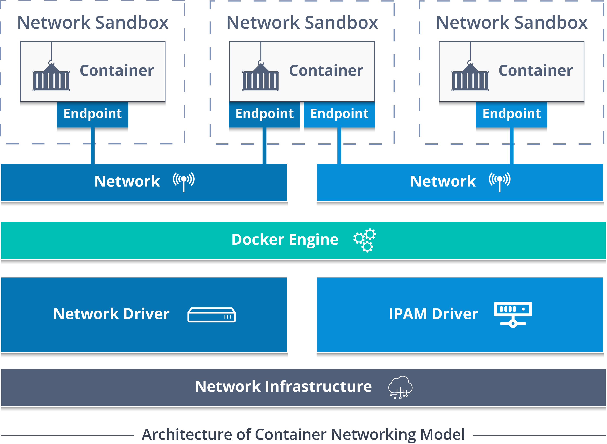

# DOCKER NOTLARI:

> - `docker info:`
	
Docker üzerinde Mevcut işletim sistemi hakkında bilgiler verir.

> - `docker search [image_name]`
	
verilen isimdeki tüm image leri sıralar

> - `docker pull [image_name]`
	
verilen isimdeki image indirilir

> - `docker ps -a | docker container ls -a`
	
ortamımızda çalışan tüm containerları gösterir. 
	-a -> exit mode daki containerları da gösterir. 
	--no-trunc -> detaylı olarak container_id lerimizi görmemize yarar 
	-q -> sadece kısa id'leri verir

> - `docker run op:v`
	
op -> seçeceğimiz linux image dosyası  
	v -> versiyon 
	example : docker run centos:7  

> - `docker container run -it op:v bash`
	
container a direkt olarak bağlanıp üzerinde işlemler yapmamızı sağlar. 
	-it -> interactive connection 
	bash -> bash ile bağlanacağımızı söylüyoruz 
	container içerisinde; 
			> exit ile çıktığımızda container ımız exit mode düşer bu yüzden ctrl+alt+q gibi kombinasyonlar ile çıkmamız gerekir.  

> - `docker container start [container_id]`
	
verdiğimiz id deki containerı exit modedan çıkarır 
	-a -> direkt attach mode da çalıştırır 

> - `docker container exec -it [container_id] bash`
	
verdiğimiz id ye bash ve -it mode da yeniden bağlanıyoruz

> - `docker container logs [container_id]`
	
ilgili id deki yapılan process hakkında logları görüntülememizi sağlar 
	-f -> canlı olarak logları izler 

> - `docker container attach [container_id]`
	
id deki kontainera direkt bağlantı yapmamızı sağlar

> - `docker container stop [container_id]`
	
ilgili container id yi durdurmamıza yarar (exit mode alır)

> - `docker container kill [container_id]`
	
ilgili id yi kill eder direkt kapatır 

> - `docker container inspect [container_id]`
	
container hakkında tüm detayları verir, özellikle config kısmında temel yapılandırma ayarlarının tümü gözükür.

> - `docker container rm [container_id]`
	
verilen container silinir.

## PORT:
> - `docker run -d -p 5000:80`
	
-p -> port mapping yapmamızı sağlar (5000 host portu) (80 tcp portu)

> - `docker container port [container_id]`
	
verilen id deki portu gösterir

## DOCKER FILE:
Docker Image lar işletim sisteminde var olan tüm bilgiler bulunur ve Dockerfile Image oluşturmak için oluşturduğumuz bir dosyadır.
> - `DOCKER FILE KOMUTLARI`
	
 
	FROM -> base image mizi göstermek için oluşturuluşmuş komuttur.
		<pre>FROM centos:7</pre>
	LABEL -> isimlendirme yapmaya yarar
		<pre>LABEL key value</pre>
	EXPOSE -> containerımızın hangi port üzerinden yayın yapacağını belirtmemize yarar
		<pre>- EXPOSE 80/TCP </pre>
	RUN -> base image kurulduktan sonra çalıştırılacak komutlar.
		<pre>
		- RUN yum -y update
		- RUN yum -y install nano
		</pre>
	CMD -> docker container ayağa kalktığında verilen komutu çalıştırır
		<pre>- CMD ping -c 10 127.0.0.1</pre>
	ENV	-> container ortam değişkeni tanımlamamıza yarar.  
	ADD -> local veya online dan veya env den containerımıza dosya kopyalamamıza yarar
		<pre>- ADD /bin/xyz /xyz</pre>
	VOLUME -> containerda ki datalarımın silinmesini istemiyorsak
		<pre>- VOLUME /MOUNT</pre>
	WORKDIR -> container çalışmaya başladığında nerede çalışmaya başlaması gerektiğini belirliyoruz.
		<pre>- WORKDIR /www/html</pre>
	MKDIR -> Klasör oluşturmamıza yarar  
	Örnek;
		<pre>`FROM ubuntu`
		`RUN apt-get -y update`
		`RUN apt-get -y upgrade`
		`RUN apt-get -y install python3 python3-pip`
		`COPY . /app`
		`WORKDIR /app`
		`EXPOSE 5000`
		</pre>

> - `docker images`
	
docker da varolan imagelerimizi gösterir

> - `docker image build -t [name] .`
	
docker file ile name adında bir image oluşturur

	
> - `docker container run -d -P [name]`
	
name adında ki image miz ile container kurar. 
	-P -> EXPOSE ile port belirttiğimizde bu portu alması için bu arguman kullanılır 
	-v -> Volume ataması yapmamıza yarar

## DOCKER Multi-Stage:
- Dockerfile da ki verimsizlikleri ortadan kaldırır.
- Boyut açısından yüksek boyutlu imagelar ile çalışmak zorunda kalmayız.

## DOCKER PLUGIN:
docker enginenin özelliklerini genişletmek için kullanılır.
> - `docker plugin install [plugin_name]`
	
verilen isimde ki plugin yüklenir.

> - `docker plugin ls`
	
yüklenilen pluginleri listeler

> - `docker plugin disable/enable [plugin_name]`
	
verilen isimdeki plugini aktif veya deaktif eder.

> - `docker plugin rm [plugin_name]`
	
verilen isimdeki plugini kaldırır.

## DOCKER Repostories:

> - `docker login`
	
docker hub profilimiz ile docker arasında bağlantı kurmak için yapılır

> - `docker push`
	
localde oluşturduğum imageleri repomuza göndermemize yarar

> - `docker login`
	
docker hub profilimiz ile docker arasında bağlantı kurmak için yapılır

> - `docker push`
	
localde oluşturduğum imageleri repomuza göndermemize yarar

## DOCKER Volume:
- Container silinse dahi içerisindeki dataları tutmak için volume kullanırız.
- Docker volume içerisindeki datalar birden fazla container kullanabilir.
- Docker Image güncellemesi yapılsa dahi volume içerisindeki datalar değişmez
- Docker volume içerisindeki datalar taşınabilir ve yedeklenebilir.
- Docker volumes container boyutunu artırmaz.

bir volume oluşturulduğunda (Docker Root Dir) de gözükür (bknz. docker info)

> - `docker volume create --name test1`
	
test1 adında bir volume oluşturulur.

> - `docker container run -it -v test1:/www/website centos:7 bash`
	
örnek kullanım. 
	test1: volumemizin oluştulacağı path  
	test1:/www/website:ro  
	ro -> readonly şeklinde de oluşturabiliriz

> - `docker volume inspect [name]`
	
verilen volume ismi hakkında bilgiler verir

> - `docker volume ls`
	
docker volume ları listeler

Docker Volume da External Stroge kurabilmek için ilk olarak nfs alanlar kullanabiliriz. 
> - `docker volume create --opt type=nfs --opt o=addr=192.168.1.10,rw,nfsserver4 --opt device=:/home/nfsshare nfs-volume`
	
opt -> özellik belirlemeye yarar
		<pre>type -> dosya sistemimizi nfs olarak ayarlıyoruz
		o=addr -> dışarıdan erişmek için bir adres veriyoruz
		,rw -> read write 
		,nfsserver4 -> verilen adresin nfsserver4 kullanmasını istiyoruz
		device -> fileshare'nin konumu neresi bunu belirliyoruz</pre>

> - `docker rm [name]`
	
volume silmek için öncelikle o volumeyi kullanan containerları silemeliyiz.
	verilen isimdeki volume silinir.

## DOCKER Network:
### CNM(Container Network Model)
- Aynı ağ üzerindeki containerların birbiri ile iletişim kurmasını sağlar.
- Çoklu network trafiğinin bölümlere ayrılmasını sağlar.
- Containerların birden fazla ağa eklenmesini sağlar

- Network Sandbox -> Container yönetim arayüzü, ip, mac adresleri ayarlamaları yapılır.
- Endpoint -> Sandbox'ın dış networke bağlanmasını sağlar. ikinci bir network'e bağlanmak için ikinci bir endpoint oluşturulabilinir
- Network -> birbiri ile iletişim kuran endpointler temsil edilir.
- Driver -> ağın sahibidir, çeşitli kullanım durumlarında dağıtım sürümünü karşılamak için burayı kullanırız, ağın yöneticisi diyebiliriz.

> - `docker network ls`
	
bütün networkleri görüntülememizi sağlar.

> - `docker network inspect [name]`
	
verilen isimdeki network hakkında detayları görüntülememizi sağlar

> - `docker run centos /usr/sbin/ip route`
	
verilen isimdeki network hakkında detayları görüntülememizi sağlar

> - `docker network create test1network`
	
test1network adında bir network oluşturur

> - `docker container run -it --net test1network centos bash`
	
oluşturulan container test1network üne eklenir

> - `docker network create --subnet 192.168.100.0/24 --gateway 192.168.100.1 --driver [bridge/host/null] test2network`
	
--subnet -> belli bir subnet verir 
	--gateway -> gateway belirlememize yarar 
	--driver -> nasıl bir türde driver belirleyeceğimize yarar bridge/host/null

> - `docker network rm test1`
	
test1 networkünü silir, silinmesi için networkün kullanılmaması gerekir

> - `docker network create -d macvlan --subnet=192.168.0.0/24 --gateway 192.168.0.1 -o parent=eth0 macvlan-mynet`
	
--subnet -> belli bir subnet verir 
	--gateway -> gateway belirlememize yarar 
	fiziksel ağa bu şekilde ağımızı bağlayabiliriz.

## Docker Compose

- Docker compose çok container lı yapıları çalıştırmak ve hızlı şekilde publish etmek için kullanılan bir docker özelliğidir. Kompleks uygulamalar geliştirirken comtainerların bağımsız şekilde ilerlemesini istediğimizde bu özelliği kullanabiliriz. 
- .yml dosyaları ile tüm hizmetleri başlatabiliriz, dockerfile gibidir ancak docker compose versiyonuna göre bir containerımda hangi özellikleri başlatacağımı hızlı bir şekilde hazırlamamıza yarar.

> - `docker compose --version`

 mevcut docker compose'un versiyonunu gösterir

> - `docker-compose build\up`

build veya up aynı işlevdedir, up komutu verildiğinde build edilmediyse ilk olarak build edilmiş olunur ve servisi ayağa kaldırır.

> - `docker-compose down`

compose tarafından yaratılan containerları sistemden kaldırır. parametreler ile volume vs. kaldırılabilinir.

> - `docker-compose ps`

servislerin çıktısını gösterir. 

> - `docker-compose run`

compose tarafından oluşturulan bir servis için ilgili aksiyonu almamıza yarar.

> - `docker-compose exec [command]`

çalışmakta olan containerda bir execute çalıştırır

> - `DOCKER COMPOSE KOMUTLARI`
	
 
	version -> ilk stepde versiyon bilgisi verilmeli. 
		<pre> version "2.6"</pre>
	services: -> servis yapılandırılmasını sağlar
		<pre>
		services:
				<pre>nginx-service:
				build: ./Website
				depends_on:
				- ruby-service
				</pre>
		</pre>
		depends_on: servisleri birbirine bağlar. 
		build: docker file pathini veririz

